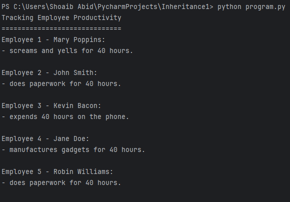

# Flexible Designs With Composition
## This project has two branches. The main related to changing the class design to implement composition, and the other one is related to customizing behavior with composition.
## Overview

This branch emphasizes composition over inheritance to achieve a more flexible and modular design. By utilizing composition, the class relationships are loosely coupled, making it easier to accommodate changes and additions.

## Design Philosophy

Composition allows for greater flexibility in accommodating changes and new behaviors. Instead of relying heavily on inheritance, you change behavior by providing new components that implement those behaviors.

## Changes Made

- Introduced the `ProductivitySystem` class using composition to manage roles.
- Implemented role classes (`ManagerRole`, `SecretaryRole`, `SalesRole`, `FactoryRole`) independently.
- Created the `PayrollSystem` class using composition to manage employee policies.
- Refactored payroll policy classes (`SalaryPolicy`, `HourlyPolicy`, `CommissionPolicy`) to be more modular.
- Added an `AddressBook` class to manage employee addresses.
- Implemented an `EmployeeDatabase` class using composition to create and manage employees.

## Class Hierarchy


## Output



## Usage

Ensure Python is installed, then run:

```bash
python program.py
